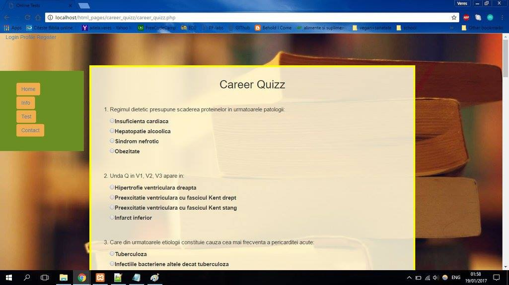
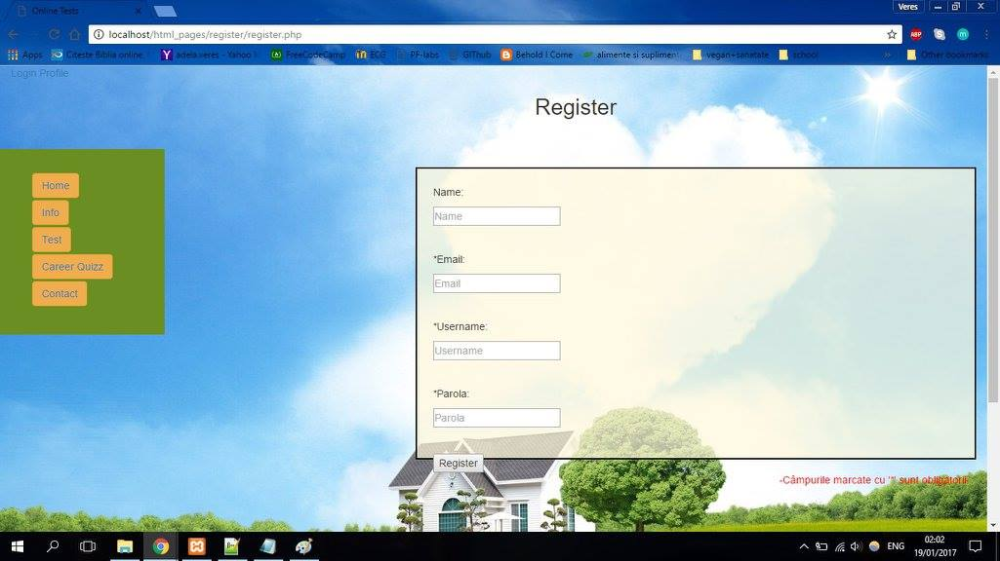
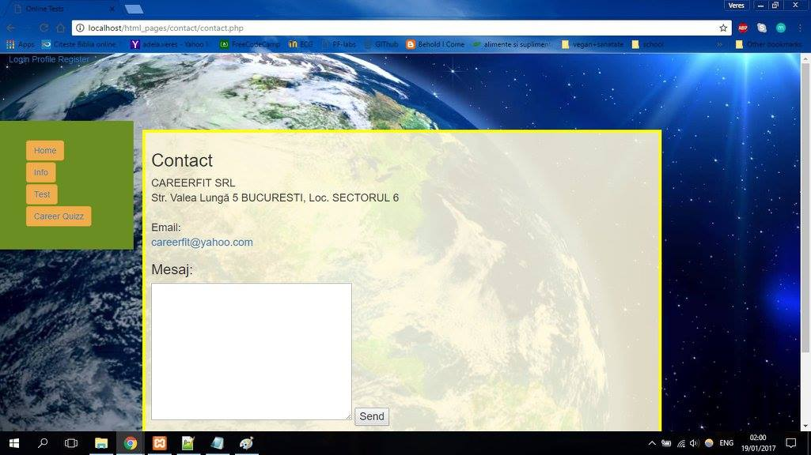

# Career orientation website

This is a school project simulating a career orientation website. 

AIM: 
* provide career-related information
* provide career orientation tests 
* provide career quizzes - that verify domain-related knowledge
* specify means to contact and get professional guidance

The website is built using MySQL, XAMPP, PHP for handling and storing data, and Html, Css, Bootstrap, for modelling the interface.
Prerequisites: installed stable version of XAMPP, MySQL.

Manual:
* find the htdocs folder local to where XAMPP was installed
* delete the content of htdocs folder
* replace it with the folder structure provided in this repo
* open a browser and type in: http://localhost/index.php, in order to open the webpage

